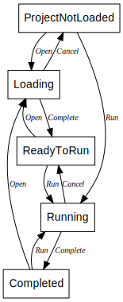

# ResponsiveFlow

ResponsiveFlow is a minimalist WPF application that measures the time of HTTP requests.


## Usage

The application takes the JSON project file as input.
It specifies the list of URLs to request, and the root directory for the output.
For an example of such a project file, see [project-example.json](./src/ResponsiveFlow.Application/project-example.json).

```json
{
  "Urls": [
    "https://jsonplaceholder.typicode.com/users/",
    "https://picsum.photos/seed/1729/350/200",
    "https://placeholder.pics/svg/350x200"
  ],
  "OutputDir": "C:/Temp/"
}
```

You can select the project file from an **Open…** menu, or pass it to the application as a `--Project` command line argument.

```sh
ResponsiveFlow.Application.exe --Project="c:/Temp/Projects/responsive-flow-project.json"
```

The output report is saved in the subfolder of the directory specified by the `OutputDir` setting.
If it's omitted, the default is the subfolder in the user's home directory.
For example _c:/Users/{Username}/Documents/ResponsiveFlow/281_01-49-19/_.

The application also accepts the _appsettings.json_ as a configuration file.
Depending on the build configuration, _appsettings.Development.json_ or _appsettings.Production.json_ is also an option, which is convenient to override the default configuration when running from the IDE.
See [appsettings-example.json](./src/ResponsiveFlow.Application/appsettings-example.json) for a reference.

```json
{
  "Logging": {
    "LogLevel": {
      "Default": "Warning"
    }
  },
  "MaxConcurrentRequests": 23
}
```

You can also set the maximum number of concurrent requests using the `--MaxConcurrentRequests` command line argument.

```sh
ResponsiveFlow.Application.exe --MaxConcurrentRequests=24
```

The continuous progress bar at the bottom of the window shows overall responsiveness;
the actual progress is shown by the progress bar at the top.

## Features

### Summary statistics for the response time distribution

The application collects a five-number summary of the distribution (minimum, maximum, median and other quartiles) along with the mean, standard deviation and standard error.

### Exporting the results

The output JSON report contains the collected metrics for each input URL.

```json
[
    {
        "UriIndex": 3,
        "Uri": "https://jsonplaceholder.typicode.com/users/",
        "Metrics": {
            "Count": 100,
            "Mean": 37.46743300000001,
            "Variance": 374.3024034905159,
            "StandardDeviation": 19.346896482136763,
            "StandardError": 1.9346896482136764,
            "Quartiles": [18.0431, 25.2191, 28.915, 39.346225000000004, 95.3742],
            "InterquartileRange": 14.127125000000003
        }
    },
    ...
]
```

### Distribution visualization

The application saves the response time histogram in SVG format.


Instead of box plots[^BP], it draws a quartile-respectful histogram with four equiprobable variable width bins using the Perfolizer library.


(These images have been carefully cherry-picked.
The usual plots are often uglier, with multiple modes and outliers.)

### Distribution comparison

The application ranks the URLs in the report according to their response times.
It uses some basic heuristics for comparison (range test, Tukey test, three-sigma test), followed by the Mann–Whitney test (from the Perfolizer library).

## Implementation details

The solution consists of three projects — Application, Presentation, and Models.

The **Application** entry point `App.Main()` serves as the composition root for setting up dependencies in the DI container.

The **Presentation** project provides the viewmodels and defines the UI logic.
The UI states and transitions between them are as follows:



All the asynchronous machinery for making requests and collecting the measurements is placed in the **Models** project.

[^BP]: I’ve Stopped Using Box Plots. Should You?  
https://nightingaledvs.com/ive-stopped-using-box-plots-should-you/
